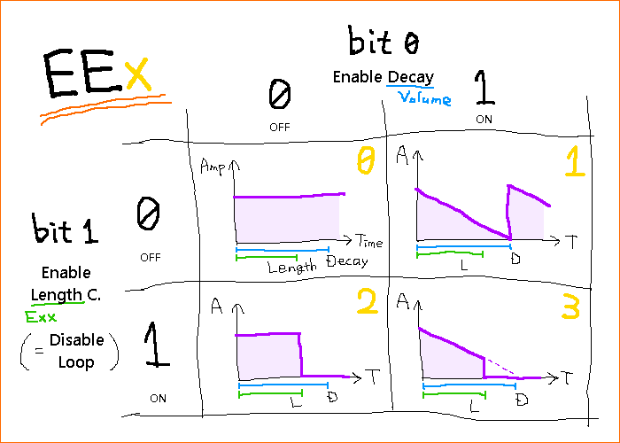

[0CC-readme.txt](0CC-readme.txt "原文ファイルへのリンク")のエフェクトとアルペジオについての記述を、ざっくり日本語訳したもの。  
どっか間違ってたらごめん。

-----


# 目次

- [1. ハードウェア音量エンベロープに関するエフェクト（2A03 & MMC5）](#1-ハードウェア音量エンベロープに関するエフェクト2a03--mmc5)
  - 1-1. `EE`x（x≦3）：ハードウェアエンベロープと音長カウンタを有効化
  - 1-2. `E`xx（xx≦0x1F）：音長カウンタを指定
  - 1-3. `S`xx（xx≧0x80、オフセット0x80）：三角波のリニアカウンタをリセット
  - 1-4. 備考

- [2. ハードウェア音量エンベロープに関するエフェクト（FDS）](#2-ハードウェア音量エンベロープに関するエフェクトfds)
  - 2-1. `E`xx（xx≦0x3F）：アタックを設定
  - 2-2. `E`xx（0x40≦xx≦0x7F、オフセット0x40）：ディケイを設定
  - 2-3. `EE0`：ハードウェア音量エンベロープを無効化
  - 2-4. 備考

- [3. 遅延チャンネルエフェクト](#3-遅延チャンネルエフェクト)
  - 3-1. `L`xx（xx≦0x7F）：XXフレーム遅延してリリース
  - 3-2. `M`xy：Xフレーム遅延して音量指定
  - 3-3. `T`xy（x≦7なら上方向、x≧8なら8オフセットして下方向）：Xフレーム遅延してトランスポーズ

- [4. FDSの自動モジュレーションエフェクト](#4-fdsの自動モジュレーションエフェクト)
  - 4-1. `I`xy（x≧1）：モジュレーション周波数を搬送波の`X/(Y+1)`倍に設定
  - 4-2. `H`xx（xx≧0x80）：モジュレータの乗数の分子を設定
  - 4-3. `Z`xx（デフォルト：Z80）：モジュレータ周波数のバイアス値を設定
  - 4-4. 備考

- [5. N163の波形バッファにアクセスするエフェクト](#5-n163の波形バッファにアクセスするエフェクト)
  - 5-1. `Z`xx（xx≦0x7E）：チャンネルの波形バッファ領域を設定
  - 5-2. `Z7F`：波形バッファ制御をリセット
  - 5-3. 備考

- [6. 配音アルペジオ](#6-配音アルペジオ)
  - 6-1. 利用方法
  - 6-2. 例
  - 6-3. 備考

-----


# 1. ハードウェア音量エンベロープに関するエフェクト（2A03 & MMC5）

2A03とMMC5の機能にアクセスするために、以下のエフェクトを追加した。  
（訳註：ノートの長さに関して「音長カウンタ」と「リニアカウンタ」というのがあるっぽい。後者は三角波専用か）


## 1-1. `EE`x（x≦3）

### 1-1A. 0bit目
- 矩形波やノイズのチャンネルの**ハードウェアエンベロープを有効化**する。  
  チャンネルの音量カラムの値が、音量の指定ではなくディケイ（減衰）率の指定効果になる。小さな値ほど減衰が早い。
- 下記の音長カウンタが無効化されている場合、出力振幅値は減衰しきった後にまた最大値に戻ってループする。  
  有効化されている場合は、減衰しきった後は0のままとなる。
- 三角波チャンネルではリニアカウンタも同時に有効化される。

### 1-1B. 1bit目
- 矩形波やノイズのチャンネルの**音長カウンタを有効化**する。
- 三角波チャンネルでは、音長カウンタとリニアカウンタの指定クロック経過のうち、どちらか早い方によって音が切れる。

### 1-1C. めんど…。
- 表にしてみた。

  


## 1-2. `E`xx（xx≦`0x1F`）
- 値に応じて、以下の一覧のように**音長カウンタを設定**する。  
  音長カウンタ自体が無効化されていた場合は強制的に有効化する。
- 矩形波、三角波、ノイズのチャンネルで動作する。
- 初期化時の値は`0x01`（音長254）。

|     |  0 |  1 |  2 |  3 |  4 |  5 |  6 |  7 |  8 |  9 |  A |  B |  C |  D |  E |  F |
|-----|----|----|----|----|----|----|----|----|----|----|----|----|----|----|----|----|
| +00 | 10 |254 | 20 |  2 | 40 |  4 | 80 |  6 |160 |  8 | 60 | 10 | 14 | 12 | 26 | 14 |
| +10 | 12 | 16 | 24 | 18 | 48 | 20 | 96 | 22 |192 | 24 | 72 | 26 | 16 | 28 | 32 | 30 |

- 三角波チャンネルではリニアカウンタの初期化も行う。  
  音長カウンタとリニアカウンタのどちらか早い方によって音が切れる。


## 1-3. `S`xx（xx≧`0x80`、オフセット`0x80`）
- 三角波チャンネルにおいて、`0x80`を引いた値として**リニアカウンタをリセット**する。  
  XXが`0x80`未満の場合、リニアカウンタと音長カウンタを無効化し、本来のノート切り捨てエフェクトとして機能する。
- 本来の`S80`～`SFF`は、残念ながら全てのチャンネルで無効となる（NSF出力の都合上）。


## 1-4. 備考
- 今のところ、ハードウェアエンベロープとリニアカウンタは240Hzで動作する。  
  音長カウンタは、2A03チャンネルでは120Hz、MMC5チャンネルでは240Hzで動作する。  
  いずれもモジュールのエンジンスピードとは独立している。  
- ハードウェアエンベロープが有効でも、チャンネルごとの音量ミキサーや音色のシーケンスは普通に機能するのでご安心を。


# 2. ハードウェア音量エンベロープに関するエフェクト（FDS）

FDSサウンドハードウェアの音量エンベロープユニットにアクセスするために、以下のエフェクトを追加した。


## 2-1. `E`xx（xx≦`0x3F`）
- ハードウェア音量エンベロープを有効化し、**正（アタック）方向の値を設定**する。  
  値が小さいほどエンベロープの立ち上がりが早くなる。


## 2-2. `E`xx（`0x40`≦xx≦`0x7F`、オフセット`0x40`）
- ハードウェア音量エンベロープを有効化し、`0x40`引いて**負（ディケイ）方向の値を設定**する。  
  値が小さいほどエンベロープの減衰が早くなる。


## 2-3. `EE0`
- **ハードウェア音量エンベロープを無効化**し、音量コントロールをトラッカーのサウンドドライバに委ねる。


## 2-4. 備考
- FDSでハードウェア音量エンベロープを有効化した場合、ノートがトリガーされるたびにFDSチャンネルは初期音量を返し、音量コントロールをエンベロープユニットに委ねる。  
- エンベロープはノートの途中でも有効化でき、アタックやディケイは即座に効果を発揮する。  
- エンベロープユニット由来でないあらゆる音量変化はメモリに残り続け、`EE0`の実行と同時にその音量値が呼び出される。


# 3. 遅延チャンネルエフェクト

一定フレーム経過後のなんやかんやをするために、以下のエフェクトを追加した。


## 3-1. `L`xx（xx≦`0x7F`）
- **XXフレーム経過後にノートのリリースを発生**させ、現在の音色で使われているシーケンスのリリース部分をトリガーする。
  - VRC7のパッチの場合、リリースコマンドをトリガーする。
  - DPCMの場合、DPCMバイアスへの書き込みなしにサンプルを停止する。
- 遅延量は`0x80`未満。


## 3-2. `M`xy
- **Xフレーム経過後にチャンネル音量をYに設定**する。  
  チャンネル音量エフェクトが遅延して起こった後、次のノートは元のチャンネル音量を再現する（音量スライドエフェクト`A`xyを使っていない限り）。
- Xフレーム経過の最中において、新しくノートが現れてもそのままチャンネル音量を設定することができるが、新しく`M`xyエフェクトが現れた場合は遅延カウンターが必ずリセットされる。

ちなみに、これは本家FamiTrackerの0.3.5以降にて予約されているエフェクト。  
0CC-FamiTrackerではどちらの値も0以外である必要がある。  
（※訳注：じゃあ0にしたらどうなるんだ。エフェクト切れるのかな。）


## 3-3. `T`xy（x≦7なら上方向、x≧8なら8オフセットして下方向）
- **Xフレーム経過後にチャンネルをY半音だけトランスポーズ**する。
- Xが7以下の場合は上方向、8以上の場合は8を引いた値として下方向。  
  つまり遅延値がとりうる範囲は0～7フレームとなる。


# 4. FDSの自動モジュレーションエフェクト

（※訳注：この章はぜんぜんいみがわからないので特に自信がない）

0CC-FamiTrackerでは元のFamiTrackerのFDS関連エフェクトをオーバーロードしている。  
以下のエフェクトで、FDSチャンネルのモジュレーション速さを実行中の搬送波の倍数値として解釈した**自動モジュレーション**（**automatic FM**）を行うことができる。


## 4-1. `I`xy（x≧1）
- 自動モジュレーションを有効化し、搬送波の`X / (Y + 1)`倍の値で**モジュレーション周波数を設定**する。
- Xは0でない必要がある。


## 4-2. `H`xx（xx≧`0x80`）
- XXが`0x80`以上のとき、**モジュレータの乗数の分子をXXに設定**する。  
  つまり乗数そのものは`XX / (Y + 1)`となる。Yは既に`I`xyエフェクトで設定されているものとする。
- このエフェクトは自動モジュレーションが無効化されている場合は何の効果もない。
- FamiTrackerのエフェクト評価順は左から右なので（`G`xx以外）、同じ行では全ての`H`xxエフェクトより右に一切の`I`xyエフェクトが存在しないようにすれば正しい効果が出る。


## 4-3. `Z`xx（デフォルト：`Z80`）
- `P`xxエフェクトのアナログ変調となる**モジュレータ周波数のバイアス値を設定**する。  
  つまり、最終的なレジスタ値はモジュレータ乗算値にバイアス値が加算されたものである。
- バイアス値のデフォルトは`0x80`。
- 現在のモジュールが線形音程モードを利用している場合、特別な操作は全く行われない。


## 4-4. 備考
- 現在の音色が0でないモジュレーション周波数を利用している場合、FDSチャンネルに自動モジュレーションは適用されない。
- エフェクトの状態は全て保持されるので、ノートを置くたびにいちいちエフェクトを追加する必要はない。
- 既存の形式のFDSエフェクトを使うと自動モジュレーションはただちに無効化されるが、バイアス値だけは保持されて、次にまた自動モジュレーションが有効になった時にその値を利用できる。


# 5. N163の波形バッファにアクセスするエフェクト

0CC-FamiTrackerには、N163チャンネル専用の新エフェクト`Z`xxが搭載されている。  
**波形バッファ**（**wave buffer**）をより効率的にコントロールすることができる。


## 5-1. `Z`xx（xx≦`0x7E`）
- **チャンネルの波形バッファ領域を設定**する。音色が指定する波形領域はオーバーライドされる。
- 波形バッファに対するあらゆる読み取り/書き込み処理において、サンプル位置はエフェクトパラメータの2倍の値で指定される（バイトあたり2サンプル）。  
  これは下記のリセットエフェクトが現れるまで保持される。
- 0CC-FamiTrackerでは、N163チャンネルが波形領域でないレジスタを読み取ろうとしていないかをチェックしているが、エクスポートするNSFファイルに対しては**このチェックは行わない**。  
  自己責任でご利用ください。

## 5-2. `Z7F`
- **波形バッファ制御をリセット**し、N163の音色の制御下に戻す。  
  音色が持つデフォルトの波形領域への読み書きができるようになる。
- このエフェクトは即座に効果を発揮する。  
  現在の音色の波形バッファへの書き込みは、`Z7F`が現れるとただちに、音色が指定する領域に対して行われるようになる。

## 5-3. 備考
- このエフェクトは、v0.3.7～0.3.8では`Y`xxというコマンドだった。  
  モジュールを読み込む時にN163専用形式の`Z`xxエフェクトへと変換されるはず。  
  （※訳注：`Z`xxはDPCMのデルタカウンタのエフェクトとしても使われている）


# 6. 配音アルペジオ

**配音アルペジオ**（**arpeggio scheme**）は、アルペジオエフェクト`0`xyを一般化したもの。  
音色のアルペジオシーケンスにおいて、`0`xyエフェクトの値を変数として入力し配音することができる。


## 6-1. 利用方法

配音アルペジオは、アルペジオシーケンスエディタのMML入力欄で利用する。  
（Sunsoft 5Bのノイズシーケンスへの対応も検討中。）  

MML入力欄では、通常の数値に対しての足し引き値として`+x`、`+y`、および`-y`が入力できる。数値の範囲は-27～+36。  
FamiTrackerのパターン上で`0`xyエフェクトが現れるたび、これらの配音用の`x`や`y`に各パラメータが代入される。

また、グラフエディタのクリック時に以下のテンキーを押しながら操作すると、対応する種類のアルペジオにアクセスできる。  
（※訳注：できなくない？）

- 0：なし
- 1：`+x`
- 2：`+y`
- 3：`-y`


## 6-2. 例

例えば、以下のような絶対アルペジオのシーケンスがあるとする。

- `| 0 12 4 16 7 19`
- `| 0 12 3 15 7 19`
- `| 0 12 5 17 9 21`

こんなん1つの配音アルペジオのシーケンスにまとめちゃえ～。

- `| 0 12 x x+12 y y+12`

元の3つのシーケンスを呼び出すには、`047`、`037`、`059`のコマンドを打てば良い。  


## 6-3. 備考

`x`や`y`は、各シーケンス項の数値の前にも後にも配置できる。  
なお、`-y`は有効だが、`-x`はそうではないことにご注意。  
そんなわけで以下のような書き方は全て有効となる。

<!-- jsのシンタックスハイライトがなんとなく見やすい -->
```js
x+12  12+x  y+12  12+y -y+12  12-y
x-12 -12+x  y-12 -12+y -y-12 -12-y
```


-----

おわり

